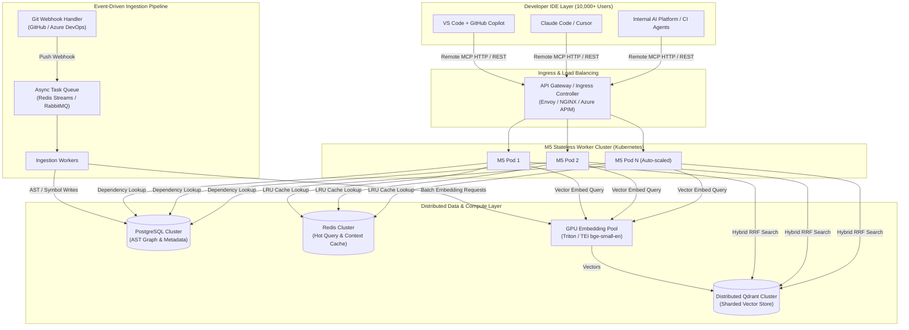

# Deployment Overview

```mermaid
flowchart TB
    subgraph Clients["Developer IDE Layer (10,000+ Users)"]
        A1["VS Code + GitHub Copilot"]
        A2["Claude Code / Cursor"]
        A3["Internal AI Platform / CI Agents"]
    end

    subgraph Gateway["Ingress & Load Balancing"]
        B["API Gateway / Ingress Controller<br/>(Envoy / NGINX / Azure APIM)"]
    end

    subgraph Service["M5 Stateless Worker Cluster (Kubernetes)"]
        C1["M5 Pod 1"]
        C2["M5 Pod 2"]
        C3["M5 Pod N (Auto-scaled)"]
    end

    subgraph Pipeline["Event-Driven Ingestion Pipeline"]
        W["Git Webhook Handler<br/>(GitHub / Azure DevOps)"]
        Q["Async Task Queue<br/>(Redis Streams / RabbitMQ)"]
        IW["Ingestion Workers"]
    end

    subgraph Data["Distributed Data & Compute Layer"]
        D1[("Distributed Qdrant Cluster<br/>(Sharded Vector Store)")]
        D2[("PostgreSQL Cluster<br/>(AST Graph & Metadata)")]
        D3[("Redis Cluster<br/>(Hot Query & Context Cache)")]
        D4["GPU Embedding Pool<br/>(Triton / TEI bge-small-en)"]
    end

    A1 & A2 & A3 -->|Remote MCP HTTP / REST| B
    B --> C1 & C2 & C3

    W -->|Push Webhook| Q
    Q --> IW
    IW -->|AST / Symbol Writes| D2
    IW -->|Batch Embedding Requests| D4
    D4 -->|Vectors| D1

    C1 & C2 & C3 -->|Hybrid RRF Search| D1
    C1 & C2 & C3 -->|Dependency Lookup| D2
    C1 & C2 & C3 -->|LRU Cache Lookup| D3
    C1 & C2 & C3 -->|Vector Embed Query| D4
```
