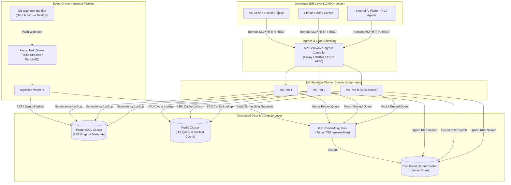

# M5 v2 Enterprise Hyperscale Deployment Guide

This document outlines the production deployment architecture for **M5 v2** at enterprise scale (10,000+ developers, 50,000+ repositories, microservices, and monorepos).

---

## 1. Architectural Philosophy: "Index Once, Serve All"

At enterprise scale, running local indexers on developer laptops is inefficient. It duplicates CPU/RAM utilization across thousands of machines and serves stale context when coworkers merge code.

M5 Enterprise uses a **Centralized Ingestion & Distributed Retrieval Architecture**:
* **Centralized Indexing**: Repositories are indexed centrally in real time upon CI/CD push events.
* **Stateless Retrieval**: M5 worker nodes handle query requests in sub-50ms via Remote HTTP MCP (`/mcp`) or REST (`/api/context`).
* **Shared Context**: All developers targeting the same repository version share the exact same up-to-date vector and AST graph indices.

---

## 2. High-Level System Architecture



---

## 3. Core Infrastructure Components

### A. Stateless M5 Worker Cluster
* **Role**: Exposes `/mcp` (Remote HTTP MCP) and `/api/context` (REST API). Runs `get_context` RRF hybrid retrieval, AST deduplication, dependency expansion, and result packaging.
* **Deployment**: Kubernetes Deployment (AKS / EKS / GKE) running stateless FastAPI/Uvicorn containers auto-scaled via Horizontal Pod Autoscaler (HPA).
* **Scaling Criteria**: CPU Utilization (>70%) or HTTP Request Rate (RPS).

### B. GPU Accelerated Embedding Fleet
* **Role**: Computes dense vector embeddings for AST code blocks and incoming search queries.
* **Technology**: Hugging Face **Text Embeddings Inference (TEI)** or **NVIDIA Triton Inference Server** running `BAAI/bge-small-en-v1.5` on NVIDIA T4/A10G GPUs.
* **Efficiency**: Offloading embeddings from CPU containers to GPU microservices increases vector generation throughput by **10x to 30x** (5,000+ embeddings/second per GPU node) with dynamic batching.

### C. Distributed Vector Store (Qdrant Cluster)
* **Role**: Dense vector storage and similarity retrieval.
* **Topology**: Multi-node Qdrant cluster on Kubernetes managed via the Qdrant Operator.
* **Optimization**:
  * **Payload Indexing**: Filterable by `org_id`, `dept_id`, and `repo_id`.
  * **Memory Strategy**: On-disk HNSW index with payload caching to handle hundreds of millions of vectors without excessive RAM expenditure.

### D. AST Graph & Metadata Store (PostgreSQL)
* **Role**: Replaces single-file SQLite in enterprise production to store AST symbol catalogs, file relationship graphs (imports/exports), and audit provenance logs.
* **Topology**: Managed PostgreSQL (e.g., Azure Database for PostgreSQL / AWS Aurora) with read replicas and connection pooling (PgBouncer).

### E. Context Caching Layer (Redis Cluster)
* **Role**: Caching frequent query vectors, BM25 term matrices for static repositories, and exact match ContextBundles.
* **TTL Policy**: Short TTL (5-15 minutes) for active repositories; long TTL for released tags/commits.

---

## 4. Continuous Delta Sync Pipeline (Tier 4 Ingestion)

To handle thousands of commits across tens of thousands of repositories without full re-indexing overhead:

```
[ GitHub / Azure DevOps ] ──► (Push Webhook) ──► [ M5 Webhook Endpoint ]
                                                          │
                                                          ▼
                                            Extract Git Delta File List
                                          (Added, Modified, Deleted)
                                                          │
                                                          ▼
                                            [ Progressive Indexer ]
                                           - Parse AST for modified files (<50ms)
                                           - Update Postgres Symbol Graph
                                           - Send new blocks to GPU Embedding Pool
                                           - Upsert vectors into Qdrant (<150ms)
```

* **Latency SLA**: Repository context synchronized in **< 200ms** from Git push completion.
* **Idempotency**: Repeated indexing of the same commit SHA produces zero duplicate records.

---

## 5. Developer Client Connectivity (VS Code Integration)

Developers connect their IDEs to the central M5 deployment via a single company-wide Remote HTTP MCP endpoint.

### Centralized VS Code Settings (`mcp_config.json`)
Distributed to developer workstations via enterprise MDM or DevContainers:

```json
{
  "mcpServers": {
    "m5-enterprise": {
      "url": "https://m5.internal.company.com/mcp",
      "headers": {
        "Authorization": "Bearer ${env:M5_API_KEY}"
      }
    }
  }
}
```

### Supported IDE Extensions
* **GitHub Copilot Chat** (Native MCP Support)
* **Claude Code / Cursor / Windsurf**
* **Internal Developer Portals & AI Services** (via `POST /api/context`)

---

## 6. Production Kubernetes Deployment Manifests

### 1. M5 Engine Deployment (`k8s/m5-deployment.yaml`)

```yaml
apiVersion: apps/v1
kind: Deployment
metadata:
  name: m5-engine
  namespace: m5-system
  labels:
    app: m5-engine
spec:
  replicas: 5
  selector:
    matchLabels:
      app: m5-engine
  template:
    metadata:
      labels:
        app: m5-engine
    spec:
      containers:
      - name: m5-engine
        image: your-registry.azurecr.io/m5-v2:latest
        imagePullPolicy: IfNotPresent
        ports:
        - containerPort: 8000
          name: http
        env:
        - name: QDRANT_URL
          value: "http://qdrant-cluster.m5-system.svc.cluster.local:6333"
        - name: DATABASE_URL
          valueFrom:
            secretKeyRef:
              name: m5-db-credentials
              key: connection_string
        - name: REDIS_URL
          value: "redis://redis-cluster.m5-system.svc.cluster.local:6379"
        - name: WORKSPACE_ROOT
          value: "/data/repos"
        resources:
          requests:
            cpu: "1000m"
            memory: "2Gi"
          limits:
            cpu: "4000m"
            memory: "8Gi"
        readinessProbe:
          httpGet:
            path: /ready
            port: 8000
          initialDelaySeconds: 5
          periodSeconds: 5
        livenessProbe:
          httpGet:
            path: /health
            port: 8000
          initialDelaySeconds: 15
          periodSeconds: 10
---
apiVersion: v1
kind: Service
metadata:
  name: m5-engine-service
  namespace: m5-system
spec:
  type: ClusterIP
  ports:
  - port: 8000
    targetPort: 8000
    name: http
  selector:
    app: m5-engine
```

---

### 2. Horizontal Pod Autoscaler (`k8s/m5-hpa.yaml`)

```yaml
apiVersion: autoscaling/v2
kind: HorizontalPodAutoscaler
metadata:
  name: m5-engine-hpa
  namespace: m5-system
spec:
  scaleTargetRef:
    apiVersion: apps/v1
    kind: Deployment
    name: m5-engine
  minReplicas: 5
  maxReplicas: 50
  metrics:
  - type: Resource
    resource:
      name: cpu
      target:
        type: Utilization
        averageUtilization: 70
  - type: Resource
    resource:
      name: memory
      target:
        type: Utilization
        averageUtilization: 80
```

---

### 3. Ingress Routing (`k8s/m5-ingress.yaml`)

```yaml
apiVersion: networking.k8s.io/v1
kind: Ingress
metadata:
  name: m5-ingress
  namespace: m5-system
  annotations:
    kubernetes.io/ingress.class: nginx
    nginx.ingress.kubernetes.io/proxy-read-timeout: "3600"
    nginx.ingress.kubernetes.io/proxy-send-timeout: "3600"
spec:
  rules:
  - host: m5.internal.company.com
    http:
      paths:
      - path: /
        pathType: Prefix
        backend:
          service:
            name: m5-engine-service
            port:
              number: 8000
```

---

## 7. Performance & Resource Capacity Sizing

For an organization with **50,000 repositories** and **10,000 active developers**:

| Dimension | Sizing Estimate | Notes |
| :--- | :--- | :--- |
| **Total AST Code Chunks** | ~50,000,000 chunks | ~1,000 chunks per repository average |
| **Qdrant Vector Storage** | ~75 GB Storage | 384-dimensional float32 vectors (`bge-small-en`) |
| **PostgreSQL Database** | ~120 GB Disk | AST symbols, dependency edges, file paths, and audit logs |
| **M5 API Pods** | 5 to 50 replicas | Auto-scales based on active developer query traffic |
| **GPU Inference Nodes** | 2 x NVIDIA T4 / A10G | Handles query vectorization and indexing queue |
| **Retrieval SLA (P95)** | **< 35 ms** | Hybrid search + RRF + dependency graph expansion |
| **Retrieval SLA (P99)** | **< 60 ms** | Includes edge cold-start lookups |

---

## 8. Monitoring & Observability

M5 exposes native health and readiness endpoints for Kubernetes and Enterprise SIEM monitoring:

* **`/health`**: Basic liveness probe (checks web process availability).
* **`/ready`**: Readiness probe (checks database connection, vector store availability, and embedding model state).
* **Audit Logging**: Exportable via `GET /api/audit/export` as NDJSON for ingestion into Splunk, Datadog, or Azure Log Analytics.

---

## 9. Step-by-Step GitHub Webhook Implementation Runbook

Once M5 is deployed at the enterprise level, follow these exact steps to configure automated real-time index synchronization across your organization's repositories.

```
 ┌─────────────────────────────┐                    ┌─────────────────────────────┐
 │    M5 SERVER (.env / K8s)   │                    │    GITHUB ORG / REPO        │
 ├─────────────────────────────┤                    ├─────────────────────────────┤
 │ GITHUB_WEBHOOK_SECRET=      │ ◄── MUST MATCH ──► │ Secret:                     │
 │ "sec_8f9a2b..."             │                    │ "sec_8f9a2b..."             │
 └─────────────────────────────┘                    └─────────────────────────────┘
```

### Phase 1: Server Infrastructure Secret Configuration
1. **Generate a High-Entropy HMAC Secret**:
   Generate a 64-character hex secret for signature verification:
   ```bash
   python -c "import secrets; print(secrets.token_hex(32))"
   ```
2. **Inject into Server Environment**:
   Store the secret in Azure Key Vault / Kubernetes Secret and map it to `GITHUB_WEBHOOK_SECRET`:
   ```yaml
   env:
   - name: GITHUB_WEBHOOK_SECRET
     valueFrom:
       secretKeyRef:
         name: m5-secrets
         key: github-webhook-secret
   ```

---

### Phase 2: Enterprise GitHub Webhook Configuration

#### Option A: GitHub Organization Webhook (Recommended for Enterprise)
*Configures all 50,000+ repositories in the organization at once.*

1. Navigate to **GitHub Organization Settings** (`https://github.com/organizations/YOUR_ORG/settings/profile`).
2. Click **Webhooks** in the left navigation menu.
3. Click **Add webhook**.
4. Configure the parameters:
   * **Payload URL**: `https://m5.internal.company.com/api/webhooks/github`
   * **Content type**: Select **`application/json`** *(Mandatory)*
   * **Secret**: Paste the generated `GITHUB_WEBHOOK_SECRET`
   * **SSL verification**: Select **Enable SSL verification**
   * **Events**: Choose **"Just the push event"** (or select **Pushes**)
5. Click **Add webhook**.

#### Option B: Single Repository Webhook (For Staging / Testing)
1. Navigate to Repository **Settings** ➔ **Webhooks** ➔ **Add webhook**.
2. Fill in the exact same parameters as above.

---

### Phase 3: Verification & Operational Health Check

1. **Trigger Test Delivery**:
   Push a commit to a tracked branch or merge a PR:
   ```bash
   git commit -m "test: verify M5 delta index"
   git push origin main
   ```
2. **Verify Server Logs**:
   Inspect M5 pod logs to confirm instantaneous handling:
   ```text
   INFO:     10.244.1.45:48392 - "POST /api/webhooks/github HTTP/1.1" 202 Accepted
   [+] Background Task: Syncing Git Delta for repo 'acme/core-service' (1 modified files)...
   [SUCCESS] Qdrant vectors & AST Graph updated in 164ms.
   ```
3. **Verify GitHub Delivery Status**:
   In GitHub Webhook Settings, scroll down to **Recent Deliveries**. Verify that the delivery status shows a green `202 Accepted` badge.

