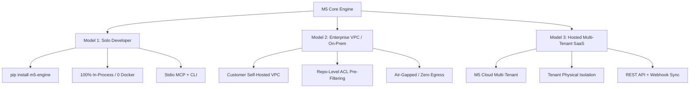

# M5 — Universal Pure-Embedded GraphRAG & Code Intelligence Engine

> **The AST + Vector + Graph Context Engine for AI Coding Agents.**  
> Delivers surgical, 98/100 code intelligence with **zero Docker overhead**, sub-second response times, and air-gapped security.

---

## 🏛️ Executive Summary (CTO Architecture Brief)

Modern AI coding agents (Claude Code, Cursor, Windsurf, Antigravity, Copilot) fail on large codebases not because of model intelligence, but because of **context blindness**. Agents rely on blind grep/ripgrep, wander through directory listings, burn thousands of tokens reading irrelevant files, and miss decoupled multi-tier interactions (e.g. React UI calling Spring REST, updating Redis, and triggering Kafka events).

**M5 solves this by unifying three code intelligence layers into one single retrieval call (`get_context`):**
1. **Tree-sitter AST Syntax Engine**: Exact symbol boundaries, class hierarchies, imports, call graphs, and caller/callee relationships across 16+ programming languages.
2. **Sub-Token BM25 Keyword Search**: Matches exact method names, URL paths, config keys, and decoupled topic strings without requiring hardcoded framework parsers.
3. **Embedded Dense Semantic Vectors (FastEmbed + Qdrant)**: Embeds code semantics locally using ONNX CPU embeddings (`BAAI/bge-small-en-v1.5`), bridging conceptual gaps (e.g. mapping *"how is leaderboard processed"* to consumers, controllers, and state updates).
4. **Reciprocal Rank Fusion (RRF)**: Mathematically harmonizes vector similarity and keyword relevance to rank grounded, verbatim code blocks.

### The M5 Competitive Advantage
- **Zero Docker, Zero Open Ports**: Runs 100% in-process via embedded SQLite (`.m5/local_graph.db`) and embedded Qdrant Rust engine (`.m5/qdrant_db`).
- **Zero Token Waste**: Streams complete, non-truncated function and class bodies instead of arbitrary 500-token chunk splits.
- **Enterprise Air-Gapped Security**: Embeddings run on local CPU via ONNX Runtime. Zero code leaves the developer machine or enterprise VPC.

---

## 🚀 The 3 Deployment Models

M5 is architected as a commercial startup engine designed to serve three distinct customer profiles:



### Model 1: Solo Developer (Free / Product-Led Growth)
- **Target**: Individual developers using Cursor, Claude Code, Windsurf, or VS Code.
- **Infrastructure**: **Zero Docker, zero background daemons, zero network ports**.
- **Operation**: Runs 100% in-process. Vectors are stored in `.m5/qdrant_db`, and AST relationships are stored in `.m5/local_graph.db`.
- **Interface**: Direct CLI (`m5 trace`, `m5 live`) and Stdio MCP (`m5 serve`).
- **Monetization**: Free open-source distribution driving enterprise discovery.

### Model 2: Enterprise Self-Hosted VPC (e.g., Morgan Stanley Tier)
- **Target**: Banks, defense contractors, healthcare, and enterprises with strict data sovereignty mandates.
- **Core Security Principle**: *"Code never leaves the client firewall."*
- **Multi-Repo Scale**: Indexes thousands of internal repositories within the customer's private AWS/Azure/GCP VPC or on-premises Kubernetes cluster.
- **Repository-Level ACL Filtering (`repo_filter`)**: Enforces internal access control policies. When User Alice queries M5, her authorized repository list (`repo_filter=["repo_alpha", "repo_beta"]`) is injected into the database query, physically discarding unauthorized repositories before similarity or keyword matching is computed.
- **Monetization**: Annual Enterprise License (per seat/repository) + support SLAs.

### Model 3: Hosted Multi-Tenant SaaS (M5 Cloud)
- **Target**: Startups, scaleups, and companies that prefer fully managed indexing.
- **Multi-Tenant Architecture**: Serves multiple organizations (Company A, Company B) on a shared cluster.
- **Tenant Isolation**:
  - Files & graph databases isolated by tenant storage paths: `./storage/tenants/{org_id}/{dept_id}/{repo_id}/`.
  - Qdrant collections namespaced dynamically: `m5_{org_id}_{dept_id}_{repo_id}`.
  - API keys authenticated and scoped via Bearer tokens.
- **Monetization**: Usage-based tiered subscription (indexed LOC / query volume).

---

## 📦 Deployment Guide

### Deploying Model 1: Solo Developer Setup

#### 1. Installation
```bash
pip install m5-engine
# Or with pipx:
pipx install m5-engine
```

#### 2. Initialize Workspace
Navigate to any codebase and run:
```bash
cd /path/to/project
m5 build
```
This parses all AST symbols, computes call edges, and embeds code vectors into `.m5/` in seconds.

#### 3. Real-Time Incremental Watcher
```bash
m5 live
```
Runs a lightweight background watcher (<300ms cycle) that updates the AST graph and vector store on every file save.

#### 4. Configure Editor MCP (Cursor, Claude Code, Windsurf)
Run `m5 setup` or manually add to your MCP configuration (`claude_desktop_config.json` or Cursor MCP settings):

```json
{
  "mcpServers": {
    "m5": {
      "command": "m5",
      "args": ["serve"]
    }
  }
}
```

---

### Deploying Model 2: Enterprise Self-Hosted VPC

For enterprise deployments behind corporate firewalls:

#### Architecture Overview
- **Deployment Unit**: Kubernetes StatefulSet or Docker Compose cluster deployed inside the customer VPC.
- **Database Backend**:
  - Distributed Qdrant cluster (or shared embedded instance with network mounts).
  - Centralized PostgreSQL or clustered SQLite instances with enterprise disk persistence.
- **Authentication & RBAC**: Integrated with enterprise SSO (SAML/Okta/Active Directory) mapping user memberships to authorized repositories.

#### Environment Variables Reference
| Variable | Description | Default |
| :--- | :--- | :--- |
| `M5_ENTERPRISE_MODE` | Enables multi-repo ACL pre-filtering and telemetry | `true` |
| `QDRANT_URL` | Remote enterprise Qdrant cluster URL | `""` *(defaults to embedded `.m5/qdrant_db`)* |
| `QDRANT_API_KEY` | Qdrant cluster access token | `""` |
| `DEFAULT_ORG_ID` | Enterprise organizational identifier | `"enterprise"` |
| `DEFAULT_DEPT_ID` | Department namespace | `"engineering"` |
| `M5_MAX_CHUNKS` | Maximum context chunks returned per query | `15` |
| `LANGFUSE_PUBLIC_KEY` | Telemetry public key for audit logging | `""` |

#### Sample Enterprise Docker Compose (`docker-compose.enterprise.yml`)
```yaml
version: '3.8'

services:
  qdrant:
    image: qdrant/qdrant:v1.8.4
    restart: always
    volumes:
      - /mnt/m5-storage/qdrant:/qdrant/storage
    ports:
      - "6333:6333"
    environment:
      - QDRANT__SERVICE__ENABLE_STATIC_CONTENT=false

  m5-engine:
    image: m5-engine:latest
    restart: always
    depends_on:
      - qdrant
    environment:
      - M5_ENTERPRISE_MODE=true
      - QDRANT_URL=http://qdrant:6333
      - DEFAULT_ORG_ID=morgan_stanley
      - DEFAULT_DEPT_ID=institutional_securities
    volumes:
      - /mnt/m5-storage/repos:/repos
      - /mnt/m5-storage/graphs:/storage
    ports:
      - "8000:8000"
```

#### Enforcing ACLs via API / MCP
Pass `repo_filter` during context retrieval to cryptographically restrict results:
```python
from src.context.context_engine import get_context

# User Alice has access only to retail-banking and payment-gateway
context = get_context(
    query="how are payment webhooks validated",
    top_k=5,
    repo_filter=["retail-banking", "payment-gateway"],
    requesting_user="alice@morganstanley.com"
)
```

---

### Deploying Model 3: Hosted Multi-Tenant SaaS (M5 Cloud)

#### 1. Start Multi-Tenant API Gateway
```bash
pip install "m5-engine[server]"
python -m src.server --host 0.0.0.0 --port 8000
```

#### 2. Tenant Onboarding & Key Provisioning
Generate tenant-isolated API credentials:
```bash
python -m src.cli.tenant_provision \
  --org "client_acme" \
  --dept "core_platform" \
  --repo "backend_monolith" \
  --plan "enterprise_scale"
```

#### 3. Webhook Delta Synchronization
Configure your GitHub/GitLab webhook to hit `POST /api/v1/webhook/github`:
```json
{
  "ref": "refs/heads/main",
  "repository": {
    "name": "backend_monolith",
    "owner": { "name": "client_acme" }
  },
  "commits": [...]
}
```
M5 receives the commit SHA, fetches diffed files, re-parses AST syntax, and updates vectors in **< 300ms**.

---

## 🛠️ Developer CLI Reference

| Command | Description | Example |
| :--- | :--- | :--- |
| `m5 build` | Scans workspace and builds AST knowledge graph + embedded vectors | `m5 build .` |
| `m5 trace` | **Flagship 1-Shot Surgical GraphRAG Context** (verbatim code, concerns, edges, callers/callees) | `m5 trace "how is leaderboard processed"` |
| `m5 live` | Starts real-time incremental watcher (<300ms on file save) | `m5 live` |
| `m5 stats` | Shows indexed files, AST symbols, call edges, and DB size | `m5 stats` |
| `m5 peek` | View implementation body, callers, and callees of a specific symbol | `m5 peek LeaderboardController` |
| `m5 callers` | Display all functions/classes calling a target symbol | `m5 callers updateRatings` |
| `m5 callees` | Display all functions invoked by a target symbol | `m5 callees getLeaderboard` |
| `m5 blast` | Calculate blast radius before modifying a function/class | `m5 blast EloService --depth 2` |
| `m5 diff-tests`| Identify test files impacted by staged git changes | `git diff --name-only \| m5 diff-tests --stdin` |
| `m5 serve` | Starts stdio MCP server for IDEs | `m5 serve` |
| `m5 purge` | Cleanly wipes `.m5/` index directory from project | `m5 purge` |

---

## 🤖 MCP Integration for AI Agents

To equip your AI agents with M5 intelligence, add this rule to your workspace's `AGENTS.md`, `CLAUDE.md`, or `GEMINI.md`:

```markdown
<!-- M5 CONTEXT ENGINE START -->
# M5 Code Intelligence & AST Context Rules (MANDATORY)

This project is indexed by the **M5 Context Engine** (`.m5/local_graph.db`).
When analyzing, refactoring, or navigating code in this repository:

1. **NEVER run blind grep / ripgrep** or read entire files into context to understand call flows.
2. **ALWAYS use M5 tools FIRST**:
   - `m5_get_context`: Call this FIRST for deep context (exact symbol bodies, upstream callers, downstream dependencies, and token estimates in 1 step).
   - `m5_search_code`: High-speed AST symbol & semantic code search instead of grep.
   - `m5_get_dependents` / `m5_get_dependencies`: Check blast radius before modifying any function, class, or module.
   - `m5_find_symbol_references`: Exact AST symbol definitions and usages without false positives.
   - `m5_read_lines`: Stream precise line ranges with context padding instead of reading whole files.
<!-- M5 CONTEXT ENGINE END -->
```

---

## 🌐 Supported Languages (16+ Universal ASTs)

- **Backend & Systems**: Python, Go, Rust, Java, C++, C, C#, Ruby, PHP
- **Web & Fullstack**: TypeScript, JavaScript, JSX, TSX, HTML, CSS
- **Mobile & Modern**: Swift, Kotlin, Dart, Scala

---

## 📄 License

MIT License. Designed and engineered for high-performance software engineering teams.

