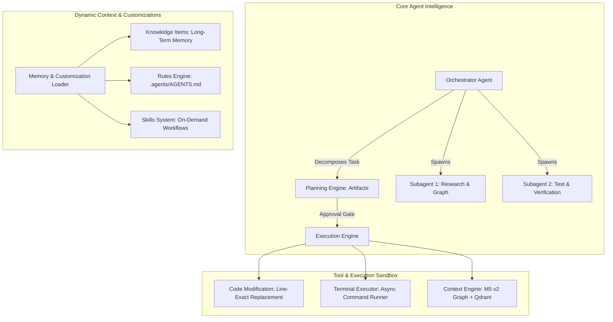

# Additional Features to Achieve Antigravity Parity (M5 v2 Roadmap)

This document outlines the architectural systems, tool suites, and execution models required to elevate **M5 v2** from a codebase context & retrieval engine into a full-scale autonomous coding platform like **Google Antigravity**.

---

## High-Level Architecture

---

## 1. Code Modification & Editing Engine (Write Capabilities)

Currently, M5 v2 is a read-only retrieval engine. To write and refactor code safely, the following tools are required:

1. **`write_to_file`**:
   - Atomic file creation with directory scaffolding.
   - Guardrails against accidental overwrites unless explicit flag is set.
2. **`replace_file_content`**:
   - Precise single contiguous block replacement targeting verified line ranges `[start_line, end_line]`.
   - Prevents file corruption by verifying target content before replacement.
3. **`multi_replace_file_content`**:
   - Executes multiple non-contiguous edits across a file in a single atomic transaction.
4. **AST Syntax & Linter Feedback Loop**:
   - Automatically runs Tree-sitter AST validation and language linters immediately after an edit to catch syntax errors before completing a turn.

---

## 2. Execution Sandbox & Terminal System

Allows the agent to run build tools, execute test suites, and manage dev servers autonomously:

1. **`run_command`**:
   - Non-blocking subprocess execution with standard output/error capture.
   - Configurable timeout and automatic async backgrounding for long-running processes.
2. **`manage_task`**:
   - Manages background tasks (`list`, `status`, `send_input`, `kill`).
3. **Security & Guardrail Filters**:
   - Prevents dangerous commands (`rm -rf /`, formatting drives, printing sensitive environment variables).

---

## 3. Dual-Mode Planning & Artifact Workflow

Separates complex problem-solving into a distinct **Planning Phase** and an **Execution Phase**:

1. **Planning Mode**:
   - For multi-file refactoring or large architectural changes, the agent conducts read-only research and creates an `implementation_plan.md` artifact.
   - Enforces an **interactive approval gate** requiring user confirmation before modifying source code.
2. **Execution Mode**:
   - Follows the approved plan step-by-step, applying edits and running tests.
3. **Walkthrough & Verification Artifacts**:
   - Automatically generates a `walkthrough.md` artifact summarizing code changes, diffs, and test outputs.

---

## 4. Multi-Agent & Subagent Delegation System

Enables deep exploration and parallelization without polluting the primary context window:

1. **Orchestrator / Planner Agent**:
   - Maintains high-level user goals and breaks them into discrete subtasks.
2. **Worker Subagents**:
   - Isolated agent instances spawned with targeted prompts (e.g., investigating a specific microservice or debugging a failing test).
   - Returns a structured observation report to the primary agent upon completion.

---

## 5. Dynamic Customization System (Skills, Rules & Knowledge Items)

Provides modular extensibility and long-term memory:

1. **Rules Engine (`.agents/AGENTS.md`, `rules/`)**:
   - Automatically injects repository-specific guidelines, coding standards, and architectural rules into agent prompts.
2. **Skills System (`skills/<name>/SKILL.md`)**:
   - On-demand cheatsheets and workflow instructions (e.g. database migrations, Kubernetes deployments, framework upgrades).
3. **Knowledge Items (KI)**:
   - Persistent snapshots of architectural patterns, known issues, and codebase conventions stored in structured JSON/Markdown.

---

## 6. Stateful Conversation Engine & Reactive Wakeup

1. **Structured Transcripts (`transcript.jsonl`)**:
   - Logs every step (Thoughts, Actions, Observations, Tool Calls) as structured JSONL for context replay, crash recovery, and history search.
2. **Reactive Event Bus**:
   - Wakes up the agent automatically when asynchronous background tasks, test suites, or webhooks complete, eliminating polling loops.
